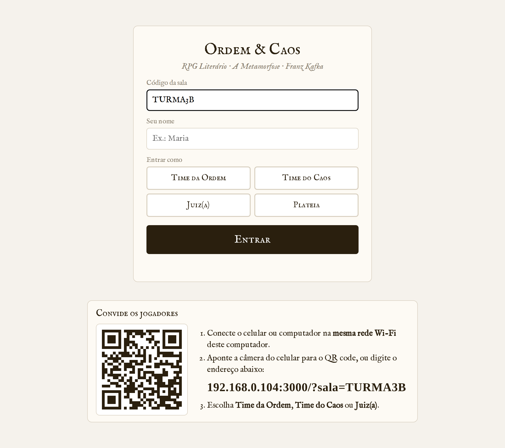
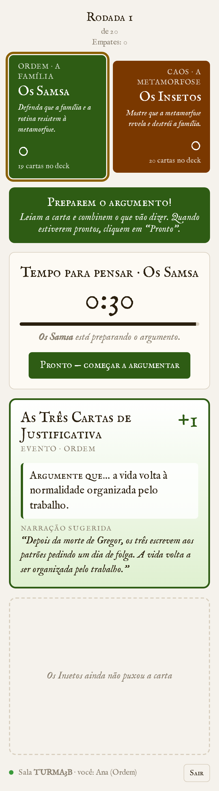
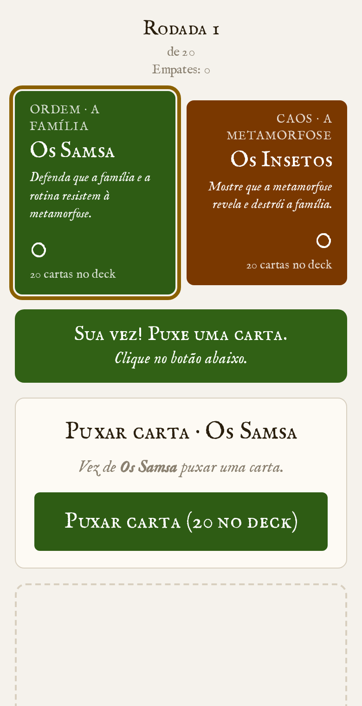
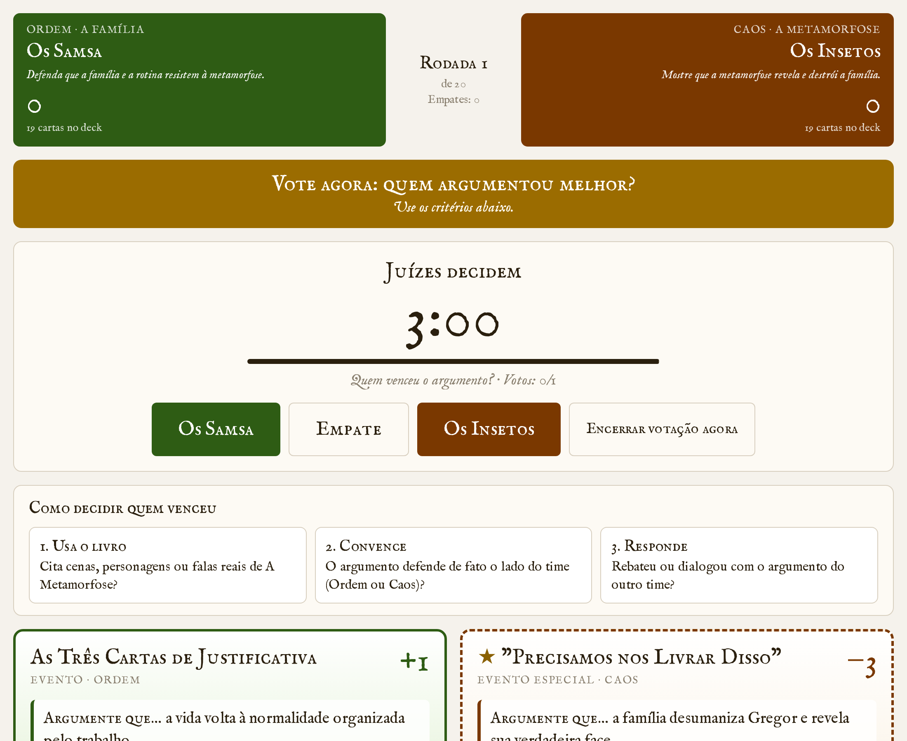

# Ordem & Caos — A Metamorfose

**RPG literário de debate sobre *A Metamorfose*, de Franz Kafka.**
Dois times (a **Ordem** e o **Caos**) puxam cartas com personagens, eventos e cenários da novela e argumentam usando o livro. Juízes decidem quem argumentou melhor em cada rodada.

Pensado para o **3.º ano do Ensino Médio**: cada aluno joga pelo próprio celular ou computador. Não precisa instalar nada nos aparelhos dos alunos, nem de conta ou de internet — só de uma rede Wi-Fi.

<p align="center">
  
  &nbsp;
  
</p>

---

## Sumário

- [Para professores: instalar e jogar](#para-professores-instalar-e-jogar)
  - [1. Baixar](#1-baixar)
  - [2. Abrir](#2-abrir)
  - [3. Convidar os alunos](#3-convidar-os-alunos)
  - [4. Jogar](#4-jogar)
  - [Se algo der errado](#se-algo-der-errado)
- [Regras do jogo](#regras-do-jogo)
- [Para desenvolvedores](#para-desenvolvedores)

---

## Para professores: instalar e jogar

### Do que você precisa

- **Um computador** (Windows, Mac ou Linux) conectado a uma rede Wi-Fi. Ele será o "centro" do jogo.
- **Os celulares ou computadores dos alunos** conectados na **mesma rede Wi-Fi**.
- Um projetor ou TV (opcional, mas ajuda muito).

> 📄 Prefere um passo a passo com imagens para imprimir? Veja o **[Guia - Como jogar (PDF)](app/docs/Guia%20-%20Como%20jogar.pdf)**. Ele também vem dentro de cada download.

### 1. Baixar

Na página **[Releases](https://github.com/FranciscoHonorat/Jogo/releases)**, baixe o arquivo do seu sistema:

| Seu computador | Arquivo |
|---|---|
| Windows | `OrdemECaos-Windows.zip` |
| Mac com chip M1, M2, M3 ou M4 | `OrdemECaos-Mac-AppleSilicon.zip` |
| Mac com processador Intel | `OrdemECaos-Mac-Intel.zip` |
| Linux | `OrdemECaos-Linux.zip` |

> Não sabe qual é o seu Mac? Clique no menu da maçã (canto superior esquerdo) → **Sobre Este Mac**. Se aparecer "Chip Apple M…", é Apple Silicon; se aparecer "Processador Intel…", é Intel.

### 2. Abrir

Os **avisos de segurança são normais**: aparecem porque o programa é novo e gratuito, não porque há algo errado.

<details open>
<summary><b>Windows</b></summary>

1. Clique com o botão direito no `.zip` → **Extrair tudo**.
2. Abra a pasta extraída e dê dois cliques em **OrdemECaos.exe**.
3. Se aparecer *"O Windows protegeu o computador"*: clique em **Mais informações** → **Executar assim mesmo**.
4. Se o Firewall perguntar: clique em **Permitir acesso**.
</details>

<details open>
<summary><b>Mac</b></summary>

1. Dê dois cliques no `.zip` para extrair.
2. Clique com o botão direito em **OrdemECaos** → **Abrir** → **Abrir** de novo.
3. Se o Mac não deixar: **Ajustes do Sistema → Privacidade e Segurança**, role até o fim e clique em **Abrir Mesmo Assim**.
</details>

<details open>
<summary><b>Linux</b></summary>

1. Extraia o `.zip`.
2. Dê dois cliques em **OrdemECaos** (ou rode `./OrdemECaos` no terminal).
</details>

Uma **janela com textos** vai aparecer. Ela é o "motor" do jogo:

```
==============================================================
   ORDEM & CAOS  -  A Metamorfose
==============================================================
   O jogo esta rodando! O navegador vai abrir sozinho.
   Para os alunos (conectados na MESMA rede Wi-Fi):
       http://192.168.0.104:3000

   NAO FECHE ESTA JANELA durante o jogo.
==============================================================
```

> ⚠️ **Não feche essa janela durante a partida** — fechar encerra o jogo. Pode minimizá-la.

### 3. Convidar os alunos

O navegador abre sozinho no seu computador com um **QR code**. Projete essa tela.

1. Os alunos conectam o celular na **mesma rede Wi-Fi** do seu computador.
2. Apontam a câmera para o QR code (ou digitam o endereço que aparece embaixo dele).
3. Escrevem o nome e escolhem um papel:

| Papel | Quem | O que faz |
|---|---|---|
| 🟩 **Time da Ordem** | alunos | Defende que a família e a rotina resistem à metamorfose. |
| 🟫 **Time do Caos** | alunos | Mostra que a metamorfose revela e destrói a família. |
| 🟨 **Juiz(a)** | professores | Inicia a partida e vota em quem argumentou melhor. |
| ⬛ **Plateia** | projetor | Só assiste. Use no computador ligado ao projetor. |

Vários alunos podem entrar no mesmo time; o primeiro a entrar escolhe o nome do time. Para separar turmas, mude o **código da sala** (ex.: `TURMA3B`) — o QR code se atualiza sozinho.

### 4. Jogar

Quando os dois times estiverem na sala, o juiz clica em **Iniciar partida**. Cada rodada funciona assim:

| | Etapa | Tempo |
|---|---|---|
| 1 | O time da vez **puxa uma carta** | — |
| 2 | O time **pensa** no argumento | 30 segundos |
| 3 | O time **argumenta em voz alta** | 2 minutos |
| 4 | O outro time faz o mesmo (passos 1 a 3) | — |
| 5 | Os juízes **votam** em quem argumentou melhor | 3 minutos |

Uma faixa colorida no topo da tela diz a cada pessoa o que fazer agora ("Sua vez! Puxe uma carta.", "Falem agora!", "Vote agora…"). O cronômetro avança sozinho, e o time pode encerrar antes clicando em **Pronto** / **Terminamos**.

<p align="center">
  
  &nbsp;
  
</p>

Quem vence a rodada ganha 1 ponto. O jogo termina depois de 20 rodadas (quando os decks acabam) ou quando o juiz clicar em **Encerrar partida**.

> 💡 **Dica para a primeira vez:** antes da aula, abra o jogo e entre pelo seu próprio celular como **Plateia**. Se funcionou, a rede está pronta. Depois, jogue **uma rodada de demonstração** com a turma.

### Se algo der errado

| Problema | O que fazer |
|---|---|
| O aluno escaneia o QR code, mas a página não abre | Confira se o celular está na **mesma rede Wi-Fi** (e não nos dados móveis). Algumas redes de escola bloqueiam a conexão entre aparelhos: nesse caso, **ligue o roteador (hotspot) do seu celular**, conecte o computador e os alunos nele, e abra o jogo de novo. |
| No Windows, cliquei em "Cancelar" no aviso do Firewall | Iniciar → digite **Firewall** → "Permitir um aplicativo pelo Firewall" → Alterar configurações → marque **OrdemECaos** em "Privada". |
| O navegador não abriu sozinho | Abra o navegador e digite `http://localhost:3000`. |
| A janela mostra outra porta (3001, 3002…) | Tudo bem: outro programa estava usando a porta 3000. Use o endereço que a janela mostra — o QR code já vem certo. |
| Fechei a janela sem querer | Abra o programa de novo. A partida recomeça do zero e os alunos precisam entrar novamente. |
| Um aluno recarregou a página | É só abrir o mesmo endereço — ele volta para o mesmo time. |
| A janela aparece e some na hora | Provavelmente o antivírus bloqueou. Libere o **OrdemECaos** no antivírus, e extraia o `.zip` antes de abrir (não abra de dentro do `.zip`). |

---

## Regras do jogo

- **Objetivo:** convencer os juízes com argumentos baseados no livro.
  - **Ordem (a Família):** defender que a família e a rotina resistem à metamorfose.
  - **Caos (a Metamorfose):** mostrar que a metamorfose revela e destrói a família.
- **Decks:** cada time tem 20 cartas (personagens, eventos, cenários e itens da novela). Cada carta traz uma frase **"Argumente que…"** com a ideia a defender e uma **narração sugerida** como ponto de partida.
- **Ordem de fala:** alterna a cada rodada (rodadas ímpares a Ordem começa; pares, o Caos).
- **Critérios dos juízes** (aparecem na tela do juiz):
  1. **Usa o livro** — cita cenas, personagens ou falas reais de *A Metamorfose*?
  2. **Convence** — o argumento defende de fato o lado do time?
  3. **Responde** — rebateu ou dialogou com o argumento do outro time?
- **Votação:** com mais de um juiz, vale a maioria; empate de votos = rodada empatada. Se o tempo acabar, contam os votos já dados.
- **Detalhe temático:** quanto mais rodadas o Caos vence, mais a tela "se metamorfoseia" (escurece, racha e entorta) — e às vezes uma barata atravessa a tela. 🪳

Materiais originais do jogo de mesa neste repositório:
[Livro de Regras](livro_de_regras.html) · [Manual da Ordem](regras_ordem.html) · [Manual do Caos](regras_caos.html) · [Cartas para imprimir (PDF)](Cartas%20—%20A%20Metamorfose%20·%20Ordem%20&%20Caos.pdf)

> A versão digital simplifica as regras de mesa: os efeitos das cartas (bloqueios, Trilha de Estabilidade) não são aplicados — quem decide cada rodada são os juízes.

---

## Para desenvolvedores

### Estrutura

```
app/
├── backend/            servidor em Go (só biblioteca padrão)
│   ├── main.go           rotas HTTP, tempo real (Server-Sent Events), inicialização
│   ├── game.go           regras: fases, turnos, timers, votação
│   ├── local.go          modo "dois cliques": IP da rede, abrir navegador, mensagens
│   └── cards.json        as 40 cartas — edite aqui
├── frontend/           Vue 3 + Vite
│   └── src/
│       ├── store.js      estado, conexão com o servidor, ações
│       ├── roach.js      a barata 🪳
│       └── components/   entrada, placar, faixa, cronômetro, carta, convite (QR), etc.
├── docs/               guia do professor (guia.html → PDF) e imagens
├── build-release.sh    gera os .zip para Windows, Mac e Linux em release/
├── Dockerfile          imagem para servidor (Vue + Go → binário único)
├── docker-compose.yml
└── deploy-ec2.sh       envia e sobe numa EC2 (Ubuntu) na porta 80
app-node/               versão anterior (Node.js), mantida como backup
```

O front-end compilado é embutido no binário Go (`//go:embed`), então o jogo inteiro é **um único executável**.

### Requisitos

- Go 1.22+
- Node.js 22+ ou 20.19+ (só para compilar o front-end)

### Rodar em desenvolvimento

```bash
# 1) compile o front uma vez (o Go precisa da pasta backend/dist para compilar)
cd app/frontend
npm install
npm run build

# 2) suba o servidor (porta 3000)
cd ../backend
go run .

# 3) em outro terminal, o Vite com recarregamento automático (porta 5173)
cd app/frontend
npm run dev
```

O Vite redireciona `/api` e `/events` para o Go na porta 3000.

Variáveis de ambiente do servidor:

| Variável | Padrão | Uso |
|---|---|---|
| `PORT` | `3000` | Porta HTTP. Se não for definida e a 3000 estiver ocupada, tenta 3001–3010. |
| `NO_BROWSER` | — | Qualquer valor desliga a abertura automática do navegador e a mensagem de boas-vindas. Dentro do Docker isso já é automático. |

### Gerar os downloads (Windows, Mac, Linux)

```bash
cd app
./build-release.sh
```

Gera `app/release/OrdemECaos-{Windows,Mac-AppleSilicon,Mac-Intel,Linux}.zip`, cada um com o executável, o `LEIA-ME.txt` e o guia em PDF. Publique-os na página de Releases do GitHub.

Se alterar o guia (`app/docs/guia.html`), gere o PDF de novo imprimindo a página no navegador em A4 ("Salvar como PDF", com gráficos de fundo) como `app/docs/Guia - Como jogar.pdf`.

### Rodar num servidor (Docker)

```bash
cd app
docker compose up -d --build          # porta 3000
PORT=80 docker compose up -d --build  # porta 80
```

### Publicar numa EC2 da AWS

Crie uma instância **Ubuntu 24.04** liberando as portas 22 (SSH) e 80 (HTTP) e rode:

```bash
cd app
./deploy-ec2.sh caminho/da-chave.pem IP_PUBLICO_DA_EC2
```

O script envia o código, instala o Docker se precisar e sobe o jogo em `http://IP_PUBLICO_DA_EC2/`.

> ⚠️ As partidas ficam **só na memória** do servidor: reiniciar o programa ou o container encerra as partidas em andamento.

### API (resumo)

| Método | Rota | Descrição |
|---|---|---|
| `POST` | `/api/join` | Entra numa sala: `{room, name, role, teamName?, token?}` → `{token, room}` |
| `POST` | `/api/action` | Ação do jogo: `{room, token, action, choice?}` — `start`, `draw`, `skip`, `vote`, `close`, `next`, `end`, `reset` |
| `GET` | `/events?room=&token=` | Stream SSE com o estado completo da sala para aquele jogador |
| `GET` | `/api/teams?room=` | Nomes dos times (usado na tela de entrada) |
| `GET` | `/api/info` | Endereços da rede local (para o QR code) |
| `GET` | `/health` | Verificação de saúde |
